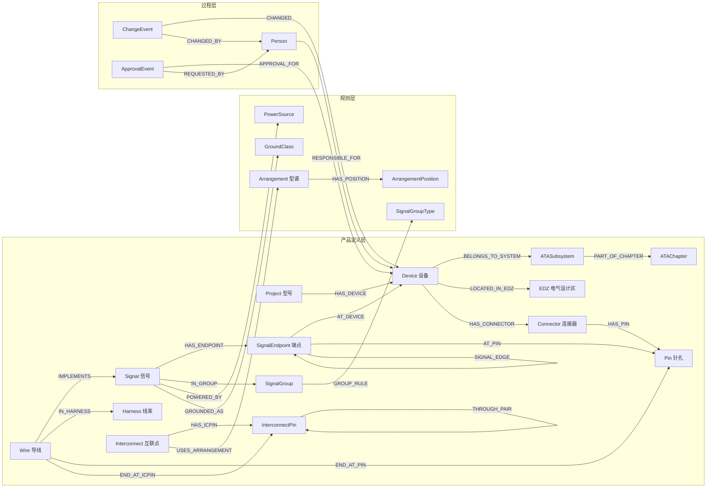

# 电动飞机全机电气接口领域本体（人读版）

版本 v1.0 · 2026-08-12 · 机器可读版见 `ontology.yaml`（ETL 与 MCP 共用同一份定义）

## 1. 设计原则

1. **翻译而非发明**：本体来自已运行的 EICD 平台数据库 schema（49 表，见 `docs/schema摸底.md`），每个类、每条关系都有源表源列，没有臆造概念。
2. **三层结构**：产品定义层（电气接口的物理与逻辑事实）、规则层（型谱/触件/电源/接地等约束知识）、过程层（谁在什么时候改了什么、经谁批准）。
3. **可回溯**：图谱中每个来源于库表的节点都携带 `source_table` / `source_id`，任何答案可定位回数据库行级证据。

## 2. 类总览（22 类）

### 产品定义层（16 类）

| 类 | 中文 | 来源 | 数量级 |
|---|---|---|---|
| Project | 型号项目 | projects | 6 |
| Region / Subregion | 机上区域/分区 | regions / subregions | 12 / 42 |
| EDZ | 电气设计区 | devices.EDZ 去重派生 | ~10² |
| ATAChapter / ATASubsystem | ATA 章 / 4 位子系统 | devices.ATA 列派生 | ~30 / ~80 |
| Device | 设备 | devices | 1,851 |
| Connector | 设备端连接器 | connectors | 4,539 |
| Pin | 针孔 | pins | 41,786 |
| Signal | 信号 | signals | 18,445 |
| SignalGroup | 信号分组 | signals.signal_group 派生 | ~10³ |
| SignalEndpoint | 信号端点 | signal_endpoints | 40,270 |
| Wire | 导线 | wires | 1,899 |
| Harness | 线束 | harnesses | 67 |
| Interconnect | 互联点（分离面/接地桩/端子排/死接头） | interconnects | 171 |
| InterconnectPin | 互联点针孔 | interconnect_pins | 6,996 |

### 规则层（5 类）

| 类 | 中文 | 来源 | 数量级 |
|---|---|---|---|
| Arrangement | 连接器型谱 | arrangements | 204 |
| ArrangementPosition | 型谱针位（几何+标准触件） | arrangement_positions | 4,287 |
| PowerSource | 独立电源代码 | signals 派生 | ~10² |
| GroundClass | 接地类别 | interconnects ∪ signals 派生 | ~10 |
| SignalGroupType | 信号分组组建规则 | signal_group_types | 100 |

### 过程层（3 类）

| 类 | 中文 | 来源 | 数量级 |
|---|---|---|---|
| Person | 人员（假名化） | users ∪ 设备负责人 | ~10² |
| ChangeEvent | 变更事件 | change_logs | 81,093 |
| ApprovalEvent | 审批事件 | approval_requests | 6,798 |

## 3. 核心关系与图形



## 4. 端到端物理链路的图谱表达（S03 链路追踪的推理基础）

一路信号的物理路径由以下模式拼接：

```
Device ─HAS_CONNECTOR→ Connector ─HAS_PIN→ Pin
   ←AT_PIN─ SignalEndpoint ←HAS_ENDPOINT─ Signal ←IMPLEMENTS─ Wire ─END_AT_PIN→ Pin(另一端)
Wire ─END_AT_ICPIN→ InterconnectPin ─THROUGH_PAIR→ InterconnectPin(对面) ←END_AT_ICPIN─ Wire(下一段)
```

即：**信号（逻辑）** 由 SIGNAL_EDGE 描述"应连什么"；**导线（物理）** 由 END_AT_* 与 THROUGH_PAIR 描述"实际怎么连"；两者经 IMPLEMENTS 对齐——这正是设计完整性检查（S09）"逻辑边是否被物理兑现"的判定结构。

## 5. 命名与回溯约定

- 节点 id：`<type>:<key>`，如 `device:1023`、`ata:24-31`、`arr:23-35SN`；库表节点带 `source_table`/`source_id`。
- 派生节点（EDZ/ATA/PowerSource/GroundClass/SignalGroup）key 含 project 维度时格式为 `<type>:<project_id>:<code>`。
- 所有中文列名原样保留在 props 中（与平台/导出 Excel 对齐，避免翻译歧义）。
